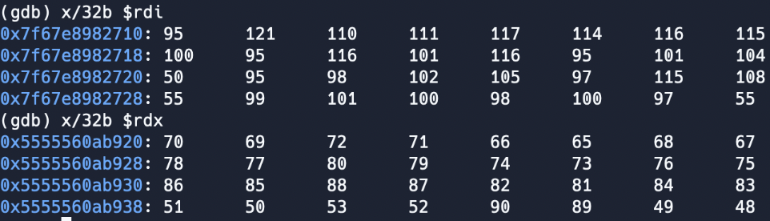

# Dyn
In the assembly code it was accepting a single command line argument. It converted the argument into a string and checked that the first 5 bytes were equal to `actf{`. Once that assertion was passed it took bytes after `actf{` and converted it into an iterator. The code then called `next` on the iterator 31 times, once more to check that the 32nd character was a `}`, and one last time to make sure there were no more characters in the string. This meant that the input was `actf{` + 32 bytes + `}`. The code then shuffled around the input and compared it to a shuffled version of the flag. To get the flag I used gdb to inputted an increasing sequence of bytes (e.g. A..Z  + 0..5), let it get shuffled, stopped the program after the input was shuffled.

`RDI` holds shuffled flag, `RDX` holds shuffled input.
```
input:          ABCDEFGHIJKLMNOPQRSTUVWXYZ012345
shuffled_input: FEHGBADCNMPOJILKVUXWRQTS3254ZY10
shuffled flag:  _ynourtsd_tet_eh2_bfiasl7cedbda7
```
Once these two strings were obtained I used the shuffled input to decode the shuffled flag by applying the operations to return the shuffled input to the original input on the shuffled flag.
```python
flag = "";
shuf = "_ynourtsd_tet_eh2_bfiasl7cedbda7";
for i in range(4):
    flag += shuf[i * 8 + 5];
    flag += shuf[i * 8 + 4];
    flag += shuf[i * 8 + 7];
    flag += shuf[i * 8 + 6];
    flag += shuf[i * 8 + 1];
    flag += shuf[i * 8];
    flag += shuf[i * 8 + 3];
    flag += shuf[i * 8 + 2];

print(flag);
```
```
> python3 decrypt.py
rusty_on_the_details_2fbdb7ac7de
```
## Flag: actf{rusty_on_the_details_2fbdb7ac7de}